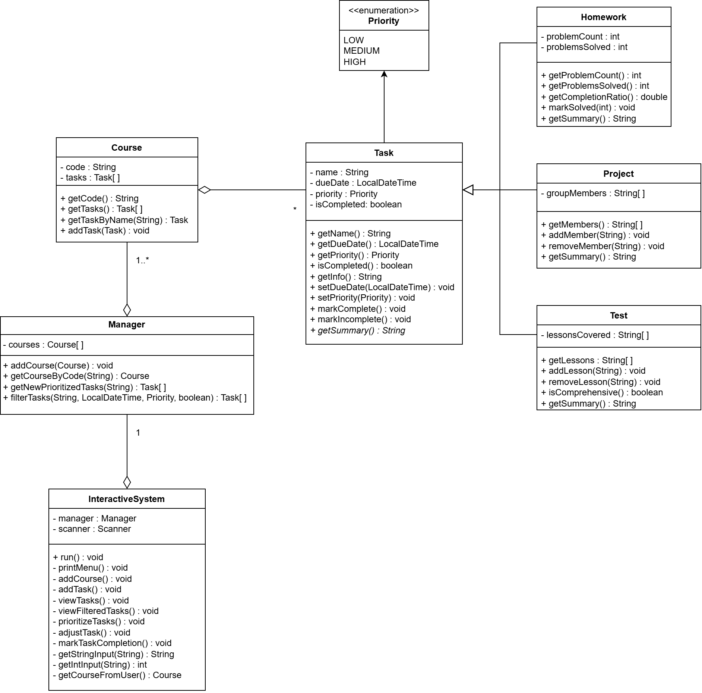

# ICS4U OOP Design Project

See instructions [here](INSTRUCTIONS.md) for details.

*UML Diagram for Student Planner*
  

## Summary
This design represents a student planner or study assistant that helps students manage their courses and tasks. It organizes assignments by due date and priority and offers additional tools to provide information about specific assignments.